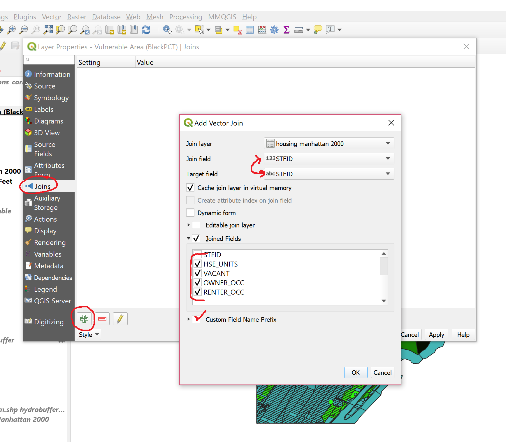

# Creating Layers from Datasets

## Adding a CSV file as a layer

Databases with no geographic information such as Comma-Separated-Values (CSV) files can also be added to QGIS. If they do not have geographic information (i.e. they cannot be projected on the map), the data can still be used by joining it to a projected dataset using a common element, and that is what we are going to do next. 

* Let's open the file "housing manhattan 2000.csv", by clicking on the `Add Delimited Text layer` button on the right-side menu (shaped like a comma). If the database has geographic data, such as Latitude and Longitude coordinates, QGIS will identify this and automatically suggest to use these to create a point vector layer. 

* This dataset doesn't have latitude/longitude, so we will have to add it with no geometry, so check the `no geometry` button. Make sure that CSV is selected as the file type, then you should see a preview of the data on the window. Click "Accept".

You will notice a new layer on the layer pane, identified with a text icon, which is QGIS' way to tell you that this layer is not represented on the map.

## Table Join

In order to use the Housing data, we have to join it to our working dataset, that is, the vulnerable area layer (note that we could also join it to other compatible layers, such as census blocks 2000). To do this:

* Right-click on the Vulnerable area layer.
* Click on `Properties`,
* Select the `Joins` tab.
* Click on the plus sign `+` button to add a new join.

* You will need to identify the join field and target field. This refers to the fields in the joining and the joined datasets that are going to be used as a reference for the join, that is, so that QGIS knows to which elements belong the attributes being added. If an attribute of this join field is not found in the joined table, it will be ignored. You can choose which fields are joined, and I suggest checking the last four so that you do not get duplicate fields. 

* Lastly, QGIS chooses a default name prefix for the joined fields, based on the filename. I strongly suggest changing this to something very short ("_", for example), because these files are in Shapefile format which fields are limited to maximum 10 characters, so you will lose the information of what each number is when you save the layer.

* Once you click on `OK`, make sure you also click `OK` in the `Layer Properties` box, and now you can open the `Attributes table` and see your newly added fields. Now you can run an analysis of housing situation for the vulnerable blocks.

## Adding a CSV file with Geometry

Now let's add the Ready NY Events CSV file. The process will be similar than adding the last CSV, but this time, make sure that `Geometry definition` is set to `Point coordinates`, and that `Latitude` and `Longitude` are being extracted from the appropriate fields. When you click `Accept`, you will likely see a warining saying that CRS was not specified so it chooses a default one. You can right-click on the layer to select the correct projection (EPSG:4269). 

When opening the `Attributes Table`, you will notice that there is information on the date of the events, and the names of the events. Events may vary considerably, as some are open to the public (for example, Citizen Preparedness Training), while others seem to be targeted at specific or exclusive audiences (Annual CLIP Teacher Conference, ABC/Disney General Presentation). Do these events occur in the most vulnerable areas? The following exercise will let us find out and practice our QGIS skills.

## Creating Booleans with the Field Calculator

First, we are going to prepare the NY Events database. We will only look at recent events, that is, events 2015 and on. However, the dates are written in an uncomfortable format (MM/DD/YYYY), because it is actually detected as a `String`. We are going to turn this into a boolean that will tell us whether an event is recent (value of 1) or not (value of 0). We will use this useful conditional formula in the `Field Calculator`:

If ("Event Date"  LIKE '%2017' or "Event Date"  LIKE '%2016' or "Event Date"  LIKE '%2015', 1, 0)

What this formula does is look at all the values of Event Date, and if they end in 2017, 2016 or 2015, it will give the new field being created a value of 1, otherwise the value will be 0.

We could even delete older events because they would not be helpful for this particular question.

[<<< Previous](17viz.md)  | [Next >>>](19extra.md)  

