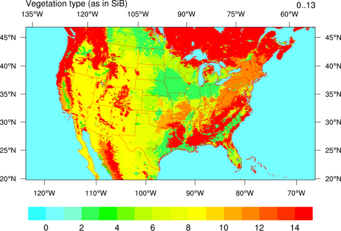

[<<< Previous](../README.md)  | [Next >>>](2setup.md)  

# Basic GIS Lexicon

A good way to start talking about GIS concepts is by looking at a conventional map and analyzing the information it shows:

CC BY-SA 3.0 derivative work: User:Justthisonceokey Blank_US_Map.svg: User:Theshibboleth – Blank_US_Map.svg: User:Theshibboleth Routes derived from Amtrak-Streckennetz.svg Speed limits own work. Inspired by High_Speed_Railroad_Map_of_Europe_2013.svg

This map shows the current rail speeds in the United States. Even without a title, it’s possible to know it's the United States because the shape of the country and the states therein are recognizable. The map also shows railroad information (the lines) and their respective speeds (different colors, according to the legend), plus cities that have railroads (red dots) and states (gray polygons). In GIS, these points, lines and polygons are known as *features*.

## Layers

Data in QGIS is organized in "layers." To understand layers, imagine having several different transparency film sheets, each one with a different type of features drawn over it. For example, one transparency sheet to display US states, another one to display only railroads, and a last one to display just the red dots that represent the cities. When these transparent sheets are overlayed on top of each other, they would look like the map above. Each of these features is represented as a vector—that is, scalable points, lines or polygons that can be easily created, edited, or deleted using QGIS.

## Features and Attributes

A feature is a entity that appears in a layer on a map. For example, each feature on the above railroads layer would represent one railroad line. An *attribute* is a characteristic of a feature, for example, speed or length of each of the railroad lines.

Each layer contains the same type of feature. For example, a typical attribute in the cities layer is population. This allows the population of one city to be compared to the population of another city. Each layer will have its own attribute table, which is basically a spreadsheet showing each feature as a row, and each attribute as a column. Just like in stats software, attributes can contain data as strings (text), numerical, date, or boolean.

## Geographic Data and Coordinate Reference System

GIS files will also include geographic data that tells QGIS what vectors to create for each feature (be they points, lines or polygons), that will be represented in space according to a Coordinate Reference System (CRS), which is basically a reference for QGIS to know how to transpose aspects in a three-dimensional spherical world into two-dimensional rectangular representations. All layers in your map must be on the same CRS, otherwise data will be inaccurate or even incompatible.

Below you will find two projections of the United States. Notice in the first one that the shape of the country is different to the shape we are used to seeing on maps, because it is a different projection (Sphere Azimuthal Equidistant projection). The second example is using a projection that is intended for Tokyo. Alaska and Hawaii are visible, but the United States mainland became a sprayed line. Tokyo would look great on this projection, though. This gives you an idea of how important CRS are, and how different the same geographic shapes can look depending on the projection.

  

Bear in mind that data might not have geographic information but could still be used in QGIS. For example, if on one hand you have a spreadsheet with data about the states, and on the other hand you have a vector layer representing states but with no attributes, you can join the dataset and the vector layer so that all the data in the spreadsheet will become attributes for the vector layer. You can also map points on a map if you have coordinates or even physical addresses. The process of using geographic data to represent features on a GIS is called georeferencing. 

## File Formats in QGIS: Shapefiles

Vector layers are commonly shared in shapefile format (.SHP). Shapefiles in GIS generate many files with the same name but different formats, and they all need to be in the same location for QGIS and other GIS software to open them correctly. Remember this when saving and copying layers. To tackle this inconvenience, GIS software has evolved and allows to read compressed files (i.e. .zip, .gz) that already contain all of the related files required by the layer.

## Other Types of Layers in QGIS: Raster Layers

There are other types of layers besides vector layers. The other most common type of layer is the raster layer, which consist of satellite images or maps for reference, aesthetics or additional information, such as grayscales or heatmaps where colors or intensity reflect a varying numerical value. Unlike vector layers, these have a specific resolution that determine how accurate the information is, as well as the file size. Raster layers are also commonly used for continuous data, such as temperature and elevation. Raster layers can be turned into vectors using QGIS, although for the data to be usable, thresholds and cutoffs must be used to narrow data in bins (i.e. elevation 0-10m; 10-20m; 20-30m…). raster layers are commonly shared in .tiff format, and the images contain metadata including georeferenciation (normally, the coordinates of each corner), and the numeric values stored in bands, which were used to generate the colors in the image.

[<<< Previous](../README.md)  | [Next >>>](2setup.md)  
